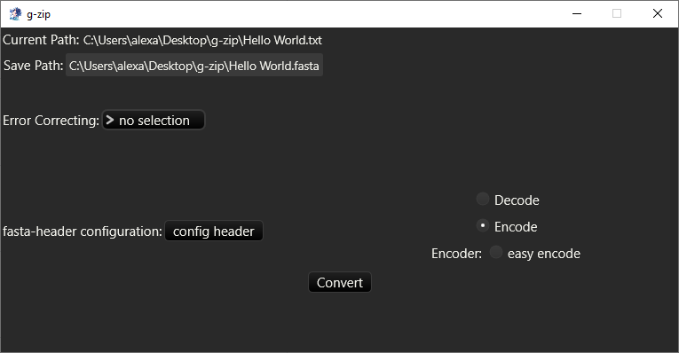

# **g-zip**

g-zip aims to be an easy to use program to convert between binary information and DNA sequences.

## **What is g-zip used for?**
Every year humanity produces unimaginable quantities of data. Most of that data is digital data. For reference: in 2018, humans produced 64 zettabytes(10^21) of data and this number doubles every year. [source](https://rivery.io/blog/big-data-statistics-how-much-data-is-there-in-the-world/)

To store all of this data, researchers work on different methods to improve current storage technology or invent new ways to store data. One of these new ways to store data is DNA.

DNA has a potential storage density 100,000 times greater than that of traditional HDD's. [source](https://www.derstandard.de/story/2000077616743/bioinformatiker-dna-speicher-kann-man-nicht-hacken) (german article) To store binary data as DNA you have to convert binary to DNA. Here comes the use case of g-zip.

With g-zip you can convert every file on your computer to a DNA sequence in a FASTA-file, use different algorithms to do that, add error-correcting codes, customize the FASTA-header and convert FASTA-files back to a binary file.

## **Examples**
Suppose you are a scientist working on a new method to store DNA containing binary information. To do that, you have to convert a file into a DNA sequence. But how do you convert a file to DNA? You could make a program that does the conversion for you yourself, but why should you waste your time making it from scratch when there already is a program doing exactly that for you? You could use the gained time to polish your research even further before publishing.

In this case, you could use g-zip (or at least I hope it could be someday) to convert your file to DNA and synthesize it to test your storage method.

## **Installation**
Download the 1.0.0 g-zip installer executable. Execute the file. The installer takes you through each steep and should be easy to understand.
If you have any problems with the installation use the options described in the "Get in contact" Section to get help.

Maybe you don't trust some sketchy executable on the internet. I can understand this. In this case you need more technical knowledge. 

First of all, fork the Repository. Check the source code for harmful code. Compile the rust code in release mode. (Make sure you have rustc 1.70.0 or a newer version installed as this is the version used to compile the code) Add the path to the executable in "g-zip installer.iss". Install [Inno Setup](https://jrsoftware.org/isdl.php) and create the installer. Use the installer to install g-zip.

## **Features**
### **1. DNA⇔Binary Conversion**
Currently there is one algorithm to convert between binary and genome. (There will hopefully be more added in the future!)
- **easy-encode / easy-decode**

    converts between binary and DNA by matching two bits to a nucleotide
    - 00 ⇔ A
    - 01 ⇔ T
    - 10 ⇔ C
    - 11 ⇔ G

### **2. Error correcting**
Again, currently there is one error correcting code available. (There will hopefully be more added in the future!)
- **7,4 Hamming-Code**

    for further information on the 7,4 Hamming-Code see [here](https://en.wikipedia.org/wiki/Hamming(7,4))

### **3. FASTA-Header customization**
You can customize the FASTA-Header. E.g. you can add the original file name, file extension or the encode algorithm to the FASTA file in case you need it at a later time.

Current possibilities for customization:
- encoded file name
- encoded file extension
- encoded file size
- add and remove as many custom messages as you want
- the encode algorithm used
- the error correcting code

I would recommend always using the last two options, in case you forget which one you used. (better safe than sorry!)

## **Usage**
If you follow this tutorial you will learn how to use g-zip. If there are any problems, consider the possibilities described in the **Get in contact** section.

In this tutorial you will convert your first file to DNA, convert it back to your original file and learn about the possibilities g-zip provides.

---
1. right-click the file you want to convert
2. select 'Start g-zip'

You should now see the following screen:

---

This section explains how you can configure the conversion to your needs.

1. This shows you the path to the file you opened with g-zip on top and below is the path the new converted file will be saved in. g-zip tries by default to save the new file in the same directory as the original file. You can change that, as well as the name and extension of the file, by simply writing into the textbox.

2. Here you can select the type of error correction you want to use.

3. Here you choose either to decode or encode your file. After choosing if you want to decode or encode, you select your specific algorithm on the bottom. (Currently there is only one for Decode and Encode to choose from, but this will hopefully change in the future!)

4. If you click 'config header' a new window will open in which you can customize your fasta header. This will not be necessary in most cases.

5. Finally, press this button to start the conversion of your file.

---

You hopefully have a understanding by now of how you can configure the conversion. To start your first basic conversion, simply select the 'easy encode' algorithm and press the 'Convert' button. There should now be a fasta file in the same directory as the file you selected at the start. If you want to look at the base sequence containing your original file, just open the fasta file with a text editor.

---

I will explain how you can convert your fasta file back to your original file:
1. right click the fasta file and select 'Start g-zip'
2. Change the file extension in the save path at the top of the screen to your original file format to avoid any confusion later (e.g. if you converted a .txt file change .fasta to .txt)
3. Select the error correcting code you used while encoding
4. Select 'Decode' if it is not already
5. Select the decode algorithm for the algorithm you used for encoding
6. Press 'Convert'

## **Roadmap**
g-zip is still under development. I still have many things I want to add. Here is a list of things I want to add in the future:
* File selection with via the windows explorer
* improve the performance of easy-encode/easy-decode
* more algorithms to convert between binary and dna
* more error-correcting algorithms

## **Get in contact**
If you have any suggestions for the UI, have any problems, need more possibilities for DNA⇔Binary Conversion or have something on your mind you want to share, feel free to open an issue describing whatever is on your mind or send me a message on discord (eco_fresh_kaese)

If you use g-zip in a real world situation (e.g. a situation similar to the one described in Examples) please let me know I would be really happy to know if this small program could help someone.

## **Contributing**
Feel free to work on an issue and make a pull request. I would be really happy if more people would work on my little project (～￣▽￣)～

A good first contribution would be to add a new error-correcting code or a new algorithm to convert between DNA and binary. Issue #23 describes how to add a new algorithm to g-zip.